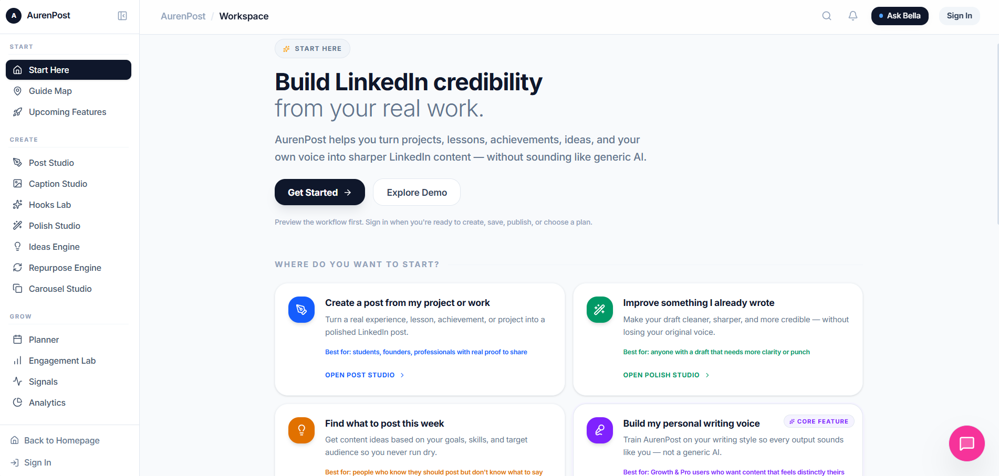
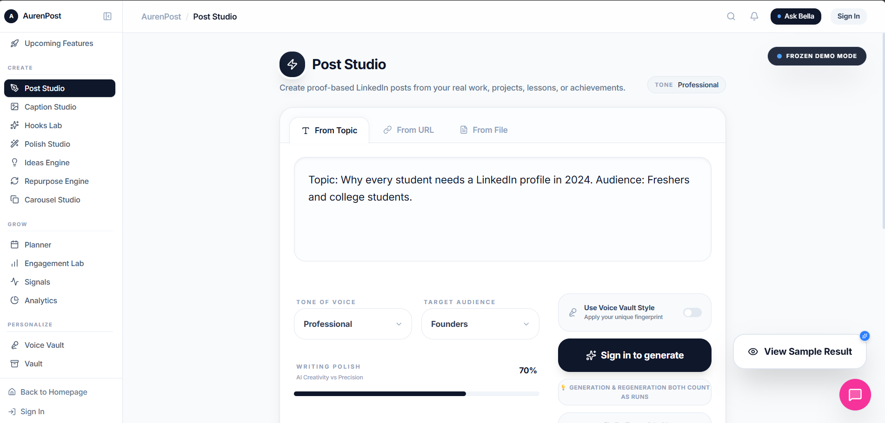

<div align="center">

# AurenPost

### AI-powered LinkedIn content and growth workspace

A full-stack SaaS product that helps professionals create structured LinkedIn posts, captions, hooks, ideas, rewrites and supporting visuals through guided AI workflows.

**Status:** Active development · Production source private

[Live Product](https://www.aurenpost.com) · [Developer Profile](https://github.com/YASHAS2928) · [LinkedIn](https://www.linkedin.com/in/yashas-r9)

</div>

---

## Product Overview

AurenPost is designed for professionals and students who want to build a stronger LinkedIn presence but struggle with content ideation, structure, consistency and personal voice.

Unlike a generic text-generation interface, AurenPost organises content creation into specialised workspaces for different stages of the LinkedIn publishing process.

The platform combines AI generation, guided workflows, user authentication, subscription entitlements, payment processing, usage tracking and a responsive product interface.

---

## Problem

Creating consistent LinkedIn content involves several disconnected tasks:

* Finding relevant content ideas
* Writing a strong opening hook
* Structuring the post clearly
* Maintaining a consistent personal voice
* Rewriting weak drafts
* Producing captions and supporting visuals
* Planning future content
* Tracking plan limits and usage

Generic AI tools can generate text, but they do not provide a dedicated workflow for managing the complete LinkedIn content lifecycle.

---

## Solution

AurenPost provides a structured workspace in which each tool solves a specific content problem.

### Main workspaces

* **Post Studio** — Generates complete LinkedIn posts
* **Caption Studio** — Creates concise captions from user context
* **Polish Studio** — Rewrites and improves existing content
* **Hooks Lab** — Produces stronger opening lines
* **Ideas Engine** — Generates relevant content directions
* **Repurpose Engine** — Converts one piece of content into new formats
* **Engagement Lab** — Supports interaction and engagement planning
* **Library** — Stores generated content for reuse
* **Planner** — Organises future content
* **Voice Vault** — Builds a reusable personal writing profile
* **Start Here** — Guides users through the product journey

---

## System Architecture

```text
User
  |
  v
React + TypeScript Frontend
  |
  v
Cloudflare Workers API
  |
  +--------------------+
  |                    |
  v                    v
Gemini AI          Supabase
Generation         Auth + PostgreSQL
  |
  v
Structured Content Output

Payment flow:
User -> Razorpay Checkout -> Payment Verification
     -> Webhook Processing -> Plan Entitlements
     -> Usage Limits and Expiry Tracking
```

A detailed architecture diagram will be added to the `assets` directory.

---

## Technology Stack

### Frontend

* React
* TypeScript
* Vite
* Tailwind CSS
* Responsive desktop and mobile interfaces

### Backend

* Cloudflare Workers
* TypeScript
* REST-style API architecture
* Server-side AI request handling

### Database and Authentication

* Supabase Authentication
* PostgreSQL
* User profiles
* Generated-content storage
* Subscription and entitlement records
* Usage counters

### Artificial Intelligence

* Google Gemini
* Structured prompt workflows
* Workspace-specific generation rules
* LinkedIn-focused formatting and tone controls

### Payments

* Razorpay
* Checkout integration
* Payment verification
* Webhook processing
* Plan activation
* Usage and expiry enforcement

### Deployment

* Vercel
* Cloudflare
* Supabase managed infrastructure

---

## Product Flow

```text
Visitor
  |
  v
Public Product Showroom
  |
  v
Sign Up / Sign In
  |
  v
Start Here Onboarding
  |
  v
Choose Workspace
  |
  v
Provide Content Context
  |
  v
AI Generation
  |
  v
Review, Edit and Save
  |
  v
Library / Planner
```

Users without an active plan can explore selected public product experiences before authentication or payment.

---

## Subscription Architecture

AurenPost supports plan-based access using entitlement and usage controls.

The subscription system handles:

* Plan activation after verified payment
* Feature-level access rules
* Generation limits
* Plan expiry dates
* Usage counter updates
* Failed or invalid payment protection
* Public access versus authenticated access
* Owner testing and administrative validation

Payment information is processed through Razorpay. Sensitive payment credentials are not exposed to the frontend.

---

## Key Engineering Decisions

### Cloudflare Workers for backend services

Cloudflare Workers were selected to provide lightweight serverless APIs with low operational overhead and straightforward deployment.

### Supabase for authentication and persistence

Supabase provided managed authentication, PostgreSQL storage and row-level data controls within one platform.

### Separate AI workspaces

Instead of exposing one generic prompt box, generation logic is divided into specialised workflows. This improves output consistency and gives users clearer control over the intended result.

### Server-side AI requests

AI-provider credentials and generation logic remain on the backend rather than being exposed in browser code.

### Entitlement-based access

Access is determined through verified subscription records and usage counters rather than relying only on frontend visibility.

---

## Engineering Challenges

### Subscription and payment consistency

The payment workflow needed to ensure that a successful checkout did not automatically grant access without backend verification.

### Usage-limit enforcement

Generation limits had to remain consistent between the interface, backend and database.

### Public and authenticated routing

The platform includes public showroom pages, authenticated workspaces and plan-restricted functionality. Routing rules had to prevent redirect loops and unauthorised access.

### AI-output consistency

Generic outputs were not sufficient. Each workspace required its own instructions, structure and quality rules.

### Responsive product experience

Desktop and mobile navigation required separate optimisation to avoid overcrowding and preserve the guided workflow.

---

## Security Considerations

* AI-provider keys are stored server-side
* Payment signatures are verified before entitlements are granted
* Authentication is managed through Supabase
* Sensitive environment variables are excluded from source control
* Protected routes validate authentication and plan access
* User-generated records are associated with authenticated user identifiers

---

## Screenshots

Screenshots will be added for:

* Start Here
* Post Studio
* Caption Studio
* Polish Studio
* Ideas Engine
* Library
* Plan and Billing
* Mobile navigation

```markdown



```

---

## My Contribution

I designed and developed the AurenPost product architecture and worked across:

* Product definition and workflow design
* Frontend development
* Backend API integration
* Authentication
* Database design
* AI-generation workflows
* Razorpay payment integration
* Subscription entitlements
* Usage-limit enforcement
* Deployment
* Testing and interface refinement

---

## Current Limitations

* AI outputs still require user review
* Analytics capabilities are currently limited
* Some advanced workspaces remain in preview or development
* The system has not yet been validated at large production scale
* Personal-voice modelling will require further evaluation and iteration

---

## Planned Improvements

* Stronger personal-voice modelling
* Output-quality evaluation
* Advanced content analytics
* Improved onboarding personalisation
* More detailed content planning
* Automated testing coverage
* Better monitoring and error observability

---

## Source-Code Availability

The production source code is private because AurenPost is an actively developed product.

This repository documents the product architecture, engineering decisions, system flows and selected implementation details without exposing credentials, proprietary prompts or production business logic.

---

## Author

**Yashas R**
AI/ML and full-stack product developer

[GitHub](https://github.com/YASHAS2928) · [LinkedIn](ADD_LINKEDIN_URL)
