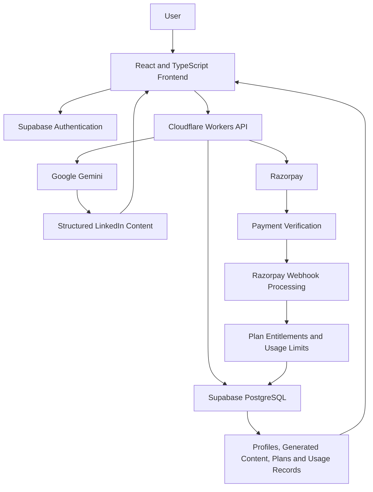
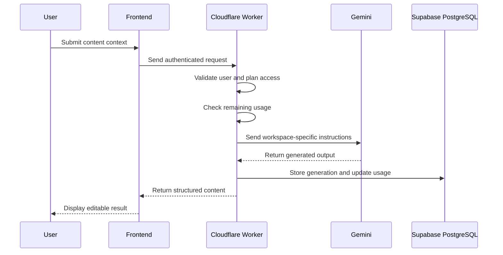
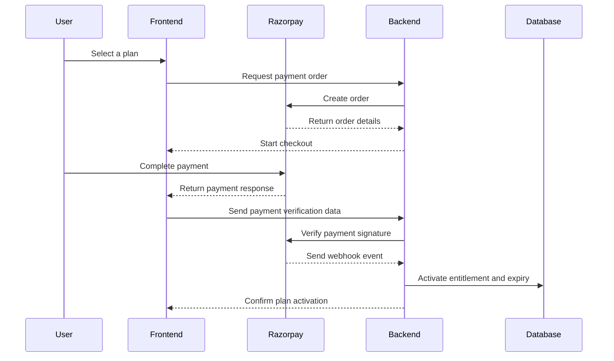
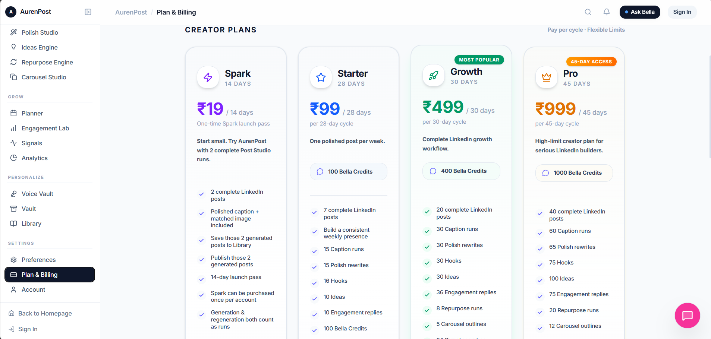

<div align="center">

# AurenPost

### AI-powered LinkedIn content and growth workspace

AurenPost is a full-stack SaaS platform that helps professionals and students create stronger LinkedIn content through specialised AI workflows, guided onboarding, content planning and subscription-based access.

[Live Product](https://www.aurenpost.com/) · [Developer Profile](https://github.com/YASHAS2928) · [LinkedIn](https://www.linkedin.com/in/yashas-r9/)

**Status:** Live product · Actively developed · Production source private

</div>

---

## Overview

AurenPost is designed for people who want to build a consistent and professional LinkedIn presence but struggle with:

* Finding relevant content ideas
* Writing strong opening hooks
* Structuring posts clearly
* Maintaining a consistent writing voice
* Improving weak drafts
* Creating captions and supporting visuals
* Organising future content
* Tracking content-generation limits

Instead of presenting users with one generic AI prompt box, AurenPost separates the LinkedIn content workflow into specialised workspaces.

Each workspace is designed around a specific outcome, such as generating a complete post, improving an existing draft, creating hooks or planning future content.

---

## The Problem

Creating high-quality LinkedIn content requires more than generating text.

Users must repeatedly move through several disconnected tasks:

1. Identify a suitable topic
2. Find an effective content angle
3. Write a strong opening
4. Structure the post
5. Adjust tone and clarity
6. Create supporting captions or visuals
7. Save and organise the output
8. Plan future content

Generic AI tools can assist with individual prompts, but they do not provide a dedicated system for managing the complete LinkedIn content lifecycle.

---

## The Solution

AurenPost provides one structured workspace for LinkedIn content creation and growth.

The platform combines:

* Specialised AI content-generation workflows
* Guided onboarding
* User authentication
* Content storage
* Subscription plans
* Payment verification
* Usage-limit enforcement
* Responsive desktop and mobile interfaces
* Public product exploration before sign-in

The product is designed to reduce prompt-writing effort and guide users towards a clear output.

---

## Core Workspaces

### Start Here

Provides guided onboarding and explains how users should move through the AurenPost workspace.

### Post Studio

Generates complete LinkedIn posts using the user’s topic, context, preferred tone and intended outcome.

### Caption Studio

Creates concise and platform-appropriate captions from user-provided context.

### Polish Studio

Improves existing drafts by strengthening clarity, structure, grammar, flow and tone.

### Hooks Lab

Generates stronger opening lines designed to capture attention without using misleading clickbait.

### Ideas Engine

Produces relevant content ideas based on the user’s expertise, goals and audience.

### Repurpose Engine

Transforms existing content into alternative formats or new LinkedIn content directions.

### Engagement Lab

Supports users with engagement-oriented content and interaction planning.

### Library

Stores generated outputs so they can be reviewed, reused or edited later.

### Planner

Helps users organise content and prepare future LinkedIn posts.

### Voice Vault

Acts as a reusable personal voice layer for maintaining more consistent writing preferences.

### Plan and Billing

Displays subscription information, usage limits, plan expiry and payment actions.

---

## System Architecture



---

## High-Level Product Flow

```mermaid
flowchart LR
    A[Visitor] --> B[Public Product Showroom]
    B --> C[Sign Up or Sign In]
    C --> D[Start Here Onboarding]
    D --> E[Select Workspace]
    E --> F[Provide Content Context]
    F --> G[AI Generation]
    G --> H[Review and Edit]
    H --> I[Save to Library]
    I --> J[Reuse or Plan Content]
```



Visitors can explore selected product experiences before authentication.

Authentication is required before accessing protected workspaces, saving content or purchasing a plan.

---

## AI Generation Flow



Each workspace uses a different generation workflow instead of sharing one unrestricted prompt.

This improves consistency and makes the output more closely aligned with the selected task.

---

## Subscription and Payment Flow



A completed checkout does not automatically grant access.

The backend verifies payment information before activating the associated plan.

---

## Technology Stack

### Frontend

* React
* TypeScript
* Vite
* Tailwind CSS
* Responsive desktop and mobile components

### Backend

* Cloudflare Workers
* TypeScript
* REST-style APIs
* Server-side AI-provider integration
* Subscription and entitlement validation

### Database and Authentication

* Supabase Authentication
* PostgreSQL
* User profiles
* Generated-content storage
* Subscription records
* Usage counters
* Plan expiry tracking

### Artificial Intelligence

* Google Gemini
* Workspace-specific generation instructions
* Structured content workflows
* LinkedIn-focused formatting rules
* Tone and output controls

### Payments

* Razorpay Checkout
* Payment-order creation
* Signature verification
* Webhook processing
* Plan activation
* Usage-limit enforcement
* Expiry handling

### Deployment and Infrastructure

* Vercel
* Cloudflare
* Supabase managed infrastructure
* Environment-based configuration

---

## Key Engineering Decisions

### Specialised workspaces instead of one generic AI interface

A single prompt box would make the product easier to build but weaker to use.

AurenPost separates content creation into specialised workspaces because generating a hook, rewriting a draft and producing a complete post require different instructions and output structures.

### Cloudflare Workers for backend services

Cloudflare Workers were selected for lightweight serverless execution, straightforward deployment and low infrastructure-management overhead.

### Supabase for authentication and persistence

Supabase provides managed authentication and PostgreSQL-based persistence within the same ecosystem.

This reduced the amount of custom authentication infrastructure required while retaining relational database capabilities.

### Server-side AI requests

AI-provider credentials and core generation logic are kept on the backend.

The frontend does not directly expose private provider keys or proprietary instructions.

### Entitlement-based access control

Feature access is determined through verified subscription and usage records.

Frontend visibility alone is not treated as a security boundary.

### Public product exploration

Visitors can understand the product before being forced to create an account.

Authentication is required only when the user attempts to access protected functionality, save data or select a paid plan.

### Guided onboarding

A dedicated Start Here experience was introduced to reduce confusion and show users which workspace to use for each goal.

---

## Data Model Overview

AurenPost uses relational records for areas such as:

* User profiles
* Authentication-linked user identifiers
* Generated posts
* Saved library items
* Subscription entitlements
* Plan names
* Activation dates
* Expiry dates
* Usage counters
* Generation limits
* Payment references

Exact production table definitions are not published in this repository.

---

## Authentication and Authorisation

AurenPost uses Supabase Authentication for user identity management.

Protected product routes validate:

* Whether the user is authenticated
* Whether the requested route is public or protected
* Whether the user has an active plan
* Whether the selected feature is included in the plan
* Whether the user has remaining generation usage
* Whether the plan has expired

Public showroom experiences are separated from authenticated product functionality.

---

## Security Considerations

* AI-provider credentials are stored server-side
* Payment signatures are verified before granting access
* Webhook events are processed through backend services
* Environment variables are excluded from public repositories
* Protected routes validate authentication and plan access
* User-generated records are associated with authenticated user identifiers
* Sensitive payment information is not stored directly by the frontend
* Production business logic and proprietary instructions remain private

This repository does not contain production secrets, environment variables, private API keys or payment credentials.

---

## Engineering Challenges

### Payment and entitlement consistency

The payment flow needed to prevent users from receiving access based only on a frontend success response.

Plan activation therefore depends on backend verification and entitlement updates.

### Usage-limit enforcement

Usage data must remain consistent across the interface, backend and database.

A successful generation should update the appropriate counter without allowing accidental duplicate deductions or unverified access.

### Public and protected routing

The platform contains:

* Public showroom pages
* Authentication pages
* Protected workspaces
* Plan-restricted functionality
* Billing pages
* Owner testing paths

Routing rules had to prevent redirect loops while maintaining appropriate access boundaries.

### AI-output consistency

Generic model responses were not sufficient for a dedicated LinkedIn product.

Each workspace required its own:

* Input structure
* Instructions
* Output format
* Tone controls
* Quality rules
* Validation expectations

### Mobile navigation

Compressing the desktop sidebar into a smaller screen created an overcrowded experience.

The mobile interface therefore required dedicated navigation and layout decisions rather than only shrinking desktop components.

### Product positioning

AurenPost had to distinguish itself from general AI chat tools.

The product experience was reorganised around outcomes, guided workflows, content storage, personal voice and plan-based access.

---

## Product Screenshots
## Product Screenshots

### Guided Onboarding

The Start Here workspace introduces the AurenPost journey and helps users identify the right content workflow.


### Post Studio

Post Studio helps users generate structured LinkedIn posts using their topic, context, preferred tone and intended outcome.


### Content Planning

The planning workspace helps users organise upcoming content and maintain a more consistent publishing workflow.




## My Contribution

I designed and developed AurenPost across product, frontend, backend and AI-integration layers.

My work includes:

* Product definition
* User-flow planning
* Workspace architecture
* Frontend development
* Responsive interface implementation
* Backend API integration
* Authentication integration
* PostgreSQL data modelling
* AI-generation workflow design
* Razorpay payment integration
* Payment verification
* Webhook handling
* Subscription entitlements
* Usage-limit enforcement
* Public showroom design
* Protected-route handling
* Deployment
* Testing
* Product-interface refinement

---

## Current Product Status

The following areas are implemented:

* User registration and sign-in
* LinkedIn OAuth flow
* Public product exploration
* Guided Start Here experience
* AI content-generation workspaces
* Generated-content storage
* Plan-based access
* Razorpay checkout
* Payment verification
* Webhook processing
* Subscription activation
* Usage counters
* Plan expiry tracking
* Responsive desktop and mobile interfaces

Some advanced workspaces and analytics capabilities remain under development or preview.

---

## Current Limitations

* AI-generated content still requires human review
* Advanced analytics are limited
* Personal-voice modelling requires further evaluation
* Some product areas remain in preview
* Automated test coverage is still being expanded
* Monitoring and observability need improvement
* The platform has not yet been validated at large production scale

These limitations are intentionally documented rather than hidden.

---

## Planned Improvements

* Stronger personal-voice modelling
* Automated output-quality evaluation
* More detailed content analytics
* Improved onboarding personalisation
* Expanded planning capabilities
* Better error monitoring
* Increased automated test coverage
* Stronger accessibility support
* Additional workspace-level evaluation
* Improved system observability
* Performance optimisation based on real usage

---

## Repository Purpose

This repository is a public technical case study.

It documents:

* Product architecture
* Engineering decisions
* System flows
* Technology choices
* Product screenshots
* Security considerations
* Current limitations
* Planned improvements

The production source code is intentionally not included.

---

## Source-Code Availability

The AurenPost production repository is private because the platform is an actively developed product.

Keeping the source private protects:

* Production credentials
* Proprietary generation instructions
* Payment implementation details
* Internal business logic
* Product-specific workflows
* Ongoing commercial development

Technical architecture and engineering decisions are documented publicly so that the project can still be evaluated without exposing sensitive implementation details.

---

## Repository Structure

```text
aurenpost-case-study/
├── assets/
│   ├── start-here.png
│   ├── post-studio.png
│   ├── caption-studio.png
│   ├── polish-studio.png
│   ├── library.png
│   ├── plan-billing.png
│   └── mobile-workspace.png
└── README.md
```

---

## Live Product

Explore AurenPost:

**https://www.aurenpost.com/**

---

## Author

**Yashas R**

Computer Science and Engineering undergraduate specialising in Artificial Intelligence and Machine Learning.

[GitHub](https://github.com/YASHAS2928) · [LinkedIn](https://www.linkedin.com/in/yashas-r9/) · [AurenPost](https://www.aurenpost.com/)

---

<div align="center">

Built as an end-to-end AI product, not only as a model demonstration.

</div>
